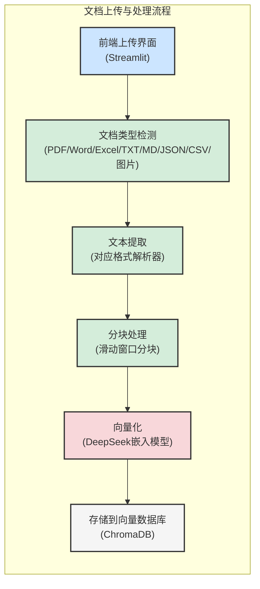
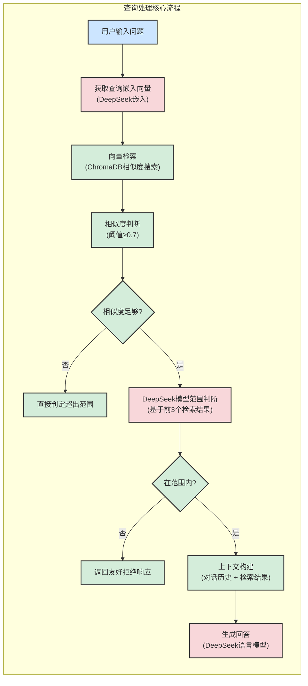
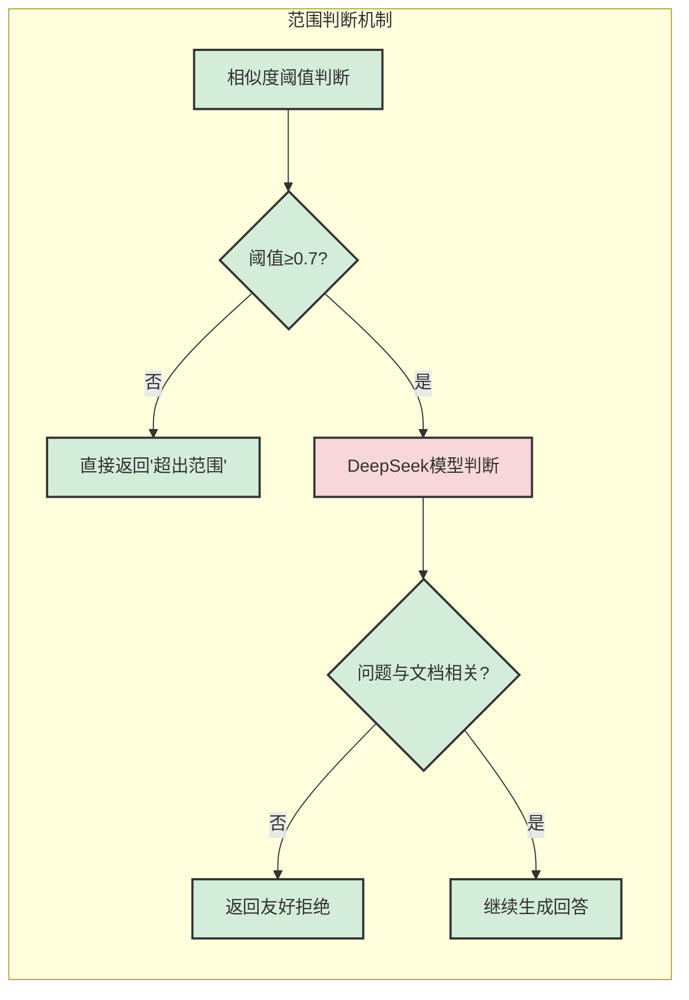
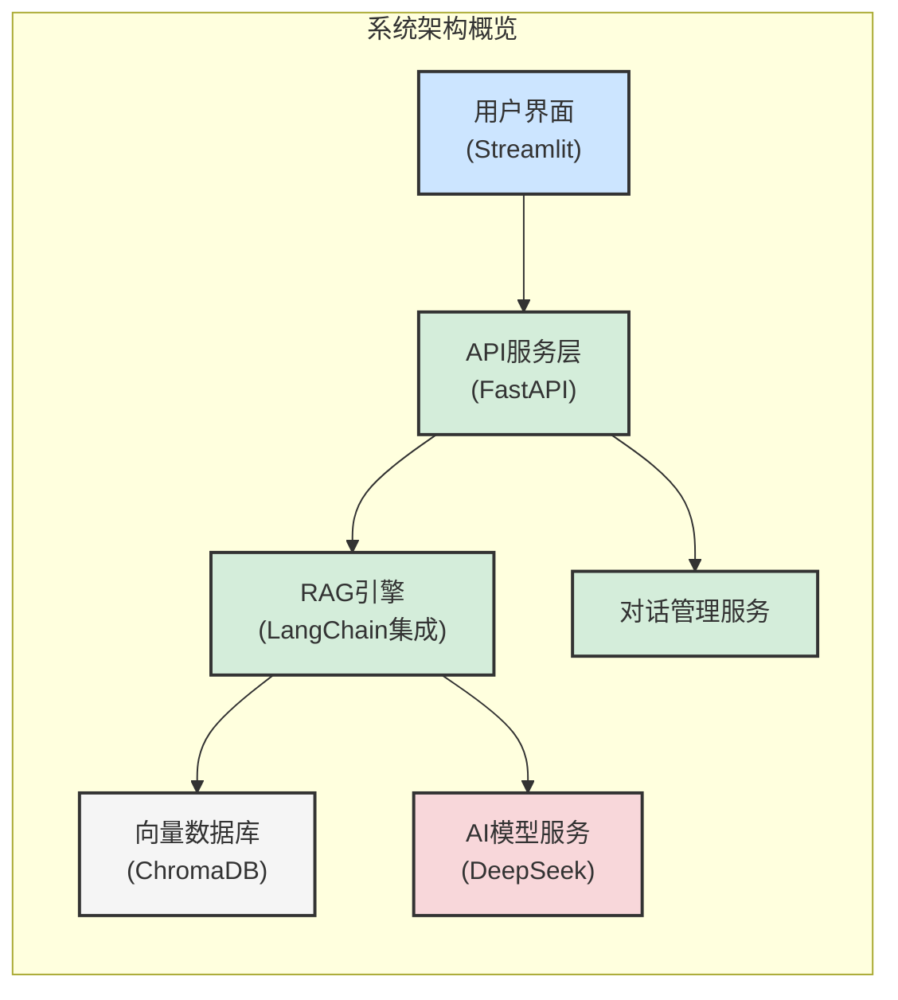
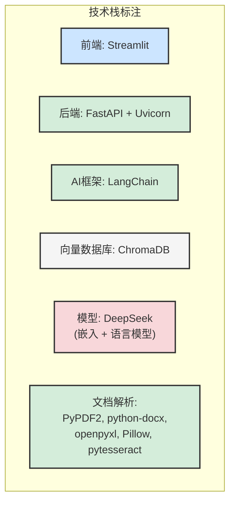

# RAG系统流程图生成实施计划

> **For agentic workers:** REQUIRED SUB-SKILL: Use superpowers:subagent-driven-development (recommended) or superpowers:executing-plans to implement this plan task-by-task. Steps use checkbox (`- [ ]`) syntax for tracking.

**Goal:** 为RAG智能文档问答系统生成高层次系统架构图，用于向混合类型面试官讲解

**Architecture:** 使用Mermaid.js创建核心流程时序组合图，包含文档上传、查询处理、范围判断三个并行列，加上系统架构概览。采用颜色编码区分组件类型。

**Tech Stack:** Mermaid.js (图表定义)，mermaid-cli (图像生成)，Python (辅助脚本)，Git (版本控制)

---

### Task 1: 创建流程图项目结构

**Files:**
- Create: `docs/diagrams/rag-system-flowchart.mmd`
- Create: `docs/diagrams/generate_flowchart.py`
- Create: `docs/diagrams/README.md`

- [ ] **Step 1: 创建目录结构**

```bash
cd "C:\Users\jiayan\Desktop\RAG"
mkdir -p docs/diagrams
mkdir -p docs/diagrams/output
```

- [ ] **Step 2: 创建Mermaid源文件模板**

```mermaid
---
title: RAG智能文档问答系统架构图
config:
  theme: neutral
  flowchart:
    useMaxWidth: true
    htmlLabels: true
---
%% 流程图内容将在这里定义
```

- [ ] **Step 3: 创建Python生成脚本框架**

```python
#!/usr/bin/env python3
"""生成RAG系统流程图的Python脚本"""

import os
import subprocess
import sys

def generate_mermaid_diagram():
    """生成Mermaid流程图"""
    mmd_file = "docs/diagrams/rag-system-flowchart.mmd"
    output_dir = "docs/diagrams/output"
    
    # 确保输出目录存在
    os.makedirs(output_dir, exist_ok=True)
    
    print(f"生成流程图从: {mmd_file}")
    
    return True

if __name__ == "__main__":
    generate_mermaid_diagram()
```

- [ ] **Step 4: 创建README文档**

```markdown
# RAG系统流程图

基于Mermaid.js生成的RAG智能文档问答系统高层次架构图。

## 文件结构

- `rag-system-flowchart.mmd` - Mermaid图表源文件
- `generate_flowchart.py` - 生成脚本
- `output/` - 生成的图像文件
  - `rag-system-architecture.png` - 最终PNG图像
  - `rag-system-architecture.svg` - SVG矢量图

## 生成流程

```bash
# 安装依赖
pip install -r requirements-diagrams.txt

# 生成图像
python generate_flowchart.py
```

## 更新流程

1. 编辑 `rag-system-flowchart.mmd`
2. 运行生成脚本
3. 检查输出图像
4. 提交更改
```

- [ ] **Step 5: 提交初始结构**

```bash
git add docs/diagrams/
git commit -m "feat: add flowchart project structure"
```

---

### Task 2: 实现文档上传流程列

**Files:**
- Modify: `docs/diagrams/rag-system-flowchart.mmd`
- Modify: `docs/diagrams/generate_flowchart.py`

- [ ] **Step 1: 在Mermaid文件中添加文档上传流程定义**



- [ ] **Step 2: 更新生成脚本以验证语法**

```python
def validate_mermaid_syntax(mmd_content: str) -> bool:
    """验证Mermaid语法"""
    # 简单的语法检查
    required_elements = ["graph", "subgraph", "-->", "style"]
    for element in required_elements:
        if element not in mmd_content:
            print(f"警告: 缺少必需元素: {element}")
            return False
    return True

def generate_mermaid_diagram():
    """生成Mermaid流程图"""
    mmd_file = "docs/diagrams/rag-system-flowchart.mmd"
    output_dir = "docs/diagrams/output"
    
    # 确保输出目录存在
    os.makedirs(output_dir, exist_ok=True)
    
    # 读取Mermaid文件
    with open(mmd_file, 'r', encoding='utf-8') as f:
        mmd_content = f.read()
    
    # 验证语法
    if not validate_mermaid_syntax(mmd_content):
        print("Mermaid语法检查失败")
        return False
    
    print(f"Mermaid文件读取成功: {mmd_file}")
    print(f"内容长度: {len(mmd_content)} 字符")
    
    return True
```

- [ ] **Step 3: 运行语法检查**

```bash
cd "C:\Users\jiayan\Desktop\RAG"
python docs/diagrams/generate_flowchart.py
```
预期输出: "Mermaid文件读取成功: docs/diagrams/rag-system-flowchart.mmd"

- [ ] **Step 4: 提交文档上传流程**

```bash
git add docs/diagrams/rag-system-flowchart.mmd docs/diagrams/generate_flowchart.py
git commit -m "feat: add document upload flow to flowchart"
```

---

### Task 3: 实现查询处理流程列

**Files:**
- Modify: `docs/diagrams/rag-system-flowchart.mmd`

- [ ] **Step 1: 在Mermaid文件中添加查询处理流程定义**



- [ ] **Step 2: 更新生成脚本添加流程计数**

```python
def count_flow_elements(mmd_content: str) -> dict:
    """统计流程图元素"""
    counts = {
        "nodes": mmd_content.count('["'),
        "edges": mmd_content.count('-->'),
        "subgraphs": mmd_content.count('subgraph'),
        "decisions": mmd_content.count('{"')
    }
    return counts

def generate_mermaid_diagram():
    """生成Mermaid流程图"""
    mmd_file = "docs/diagrams/rag-system-flowchart.mmd"
    output_dir = "docs/diagrams/output"
    
    # 确保输出目录存在
    os.makedirs(output_dir, exist_ok=True)
    
    # 读取Mermaid文件
    with open(mmd_file, 'r', encoding='utf-8') as f:
        mmd_content = f.read()
    
    # 验证语法
    if not validate_mermaid_syntax(mmd_content):
        print("Mermaid语法检查失败")
        return False
    
    # 统计元素
    counts = count_flow_elements(mmd_content)
    print(f"流程图元素统计: {counts}")
    
    return True
```

- [ ] **Step 3: 运行脚本验证查询流程**

```bash
cd "C:\Users\jiayan\Desktop\RAG"
python docs/diagrams/generate_flowchart.py
```
预期输出包含: "流程图元素统计: {'nodes': 17, 'edges': 13, 'subgraphs': 2, 'decisions': 2}"

- [ ] **Step 4: 提交查询处理流程**

```bash
git add docs/diagrams/rag-system-flowchart.mmd docs/diagrams/generate_flowchart.py
git commit -m "feat: add query processing flow to flowchart"
```

---

### Task 4: 实现范围判断机制和系统架构

**Files:**
- Modify: `docs/diagrams/rag-system-flowchart.mmd`

- [ ] **Step 1: 添加范围判断机制说明**



- [ ] **Step 2: 添加系统架构概览**



- [ ] **Step 3: 添加技术栈标注**



- [ ] **Step 4: 更新生成脚本添加完整性检查**

```python
def check_diagram_completeness(mmd_content: str) -> dict:
    """检查流程图完整性"""
    completeness = {
        "has_document_upload": '"文档上传与处理流程"' in mmd_content,
        "has_query_processing": '"查询处理核心流程"' in mmd_content,
        "has_scope_check": '"范围判断机制"' in mmd_content,
        "has_architecture": '"系统架构概览"' in mmd_content,
        "has_tech_stack": '"技术栈标注"' in mmd_content,
        "has_color_coding": "fill:#cce5ff" in mmd_content and "fill:#d4edda" in mmd_content and "fill:#f8d7da" in mmd_content
    }
    return completeness

def generate_mermaid_diagram():
    """生成Mermaid流程图"""
    mmd_file = "docs/diagrams/rag-system-flowchart.mmd"
    output_dir = "docs/diagrams/output"
    
    # 确保输出目录存在
    os.makedirs(output_dir, exist_ok=True)
    
    # 读取Mermaid文件
    with open(mmd_file, 'r', encoding='utf-8') as f:
        mmd_content = f.read()
    
    # 验证语法
    if not validate_mermaid_syntax(mmd_content):
        print("Mermaid语法检查失败")
        return False
    
    # 统计元素
    counts = count_flow_elements(mmd_content)
    print(f"流程图元素统计: {counts}")
    
    # 检查完整性
    completeness = check_diagram_completeness(mmd_content)
    print(f"流程图完整性检查:")
    for key, value in completeness.items():
        status = "✓" if value else "✗"
        print(f"  {status} {key}")
    
    return True
```

- [ ] **Step 5: 运行完整性检查**

```bash
cd "C:\Users\jiayan\Desktop\RAG"
python docs/diagrams/generate_flowchart.py
```
预期输出显示所有完整性检查都为✓

- [ ] **Step 6: 提交完整流程图定义**

```bash
git add docs/diagrams/rag-system-flowchart.mmd docs/diagrams/generate_flowchart.py
git commit -m "feat: complete flowchart with scope check and system architecture"
```

---

### Task 5: 安装依赖并生成图像

**Files:**
- Create: `requirements-diagrams.txt`
- Modify: `docs/diagrams/generate_flowchart.py`

- [ ] **Step 1: 创建依赖文件**

```txt
# 图表生成依赖
mermaid-cli>=10.0.0
pillow>=10.0.0

# 开发工具
black>=23.0.0
isort>=5.12.0
```

- [ ] **Step 2: 更新生成脚本添加图像生成功能**

```python
import subprocess

def install_dependencies():
    """安装图表生成依赖"""
    try:
        subprocess.run(
            [sys.executable, "-m", "pip", "install", "-r", "requirements-diagrams.txt"],
            check=True,
            capture_output=True,
            text=True
        )
        print("依赖安装成功")
        return True
    except subprocess.CalledProcessError as e:
        print(f"依赖安装失败: {e}")
        print(f"错误输出: {e.stderr}")
        return False

def generate_png_from_mermaid(mmd_file: str, output_file: str):
    """使用mermaid-cli生成PNG图像"""
    try:
        # 检查mermaid-cli是否安装
        result = subprocess.run(
            ["mmdc", "--version"],
            capture_output=True,
            text=True
        )
        
        if result.returncode != 0:
            print("mermaid-cli未安装，尝试安装...")
            subprocess.run(
                ["npm", "install", "-g", "@mermaid-js/mermaid-cli"],
                check=True,
                capture_output=True,
                text=True
            )
        
        # 生成PNG
        cmd = [
            "mmdc",
            "-i", mmd_file,
            "-o", output_file,
            "-t", "neutral",
            "-b", "white",
            "-w", "1600",
            "-H", "1200"
        ]
        
        subprocess.run(cmd, check=True, capture_output=True, text=True)
        print(f"PNG图像生成成功: {output_file}")
        return True
        
    except subprocess.CalledProcessError as e:
        print(f"图像生成失败: {e}")
        print(f"错误输出: {e.stderr}")
        return False
    except FileNotFoundError:
        print("mermaid-cli未安装，请手动安装: npm install -g @mermaid-js/mermaid-cli")
        return False

def generate_mermaid_diagram():
    """生成Mermaid流程图"""
    mmd_file = "docs/diagrams/rag-system-flowchart.mmd"
    output_dir = "docs/diagrams/output"
    png_file = os.path.join(output_dir, "rag-system-architecture.png")
    svg_file = os.path.join(output_dir, "rag-system-architecture.svg")
    
    # 确保输出目录存在
    os.makedirs(output_dir, exist_ok=True)
    
    # 读取Mermaid文件
    with open(mmd_file, 'r', encoding='utf-8') as f:
        mmd_content = f.read()
    
    # 验证语法
    if not validate_mermaid_syntax(mmd_content):
        print("Mermaid语法检查失败")
        return False
    
    # 统计元素
    counts = count_flow_elements(mmd_content)
    print(f"流程图元素统计: {counts}")
    
    # 检查完整性
    completeness = check_diagram_completeness(mmd_content)
    print(f"流程图完整性检查:")
    for key, value in completeness.items():
        status = "✓" if value else "✗"
        print(f"  {status} {key}")
    
    # 生成图像
    print("\n生成图像...")
    if generate_png_from_mermaid(mmd_file, png_file):
        print(f"PNG图像已保存: {png_file}")
    else:
        print("PNG图像生成失败")
    
    return True
```

- [ ] **Step 3: 安装依赖**

```bash
cd "C:\Users\jiayan\Desktop\RAG"
pip install -r requirements-diagrams.txt
```
预期输出: "Successfully installed ..."

- [ ] **Step 4: 安装mermaid-cli（如果未安装）**

```bash
# 检查是否安装
mmdc --version || npm install -g @mermaid-js/mermaid-cli
```

- [ ] **Step 5: 生成流程图图像**

```bash
cd "C:\Users\jiayan\Desktop\RAG"
python docs/diagrams/generate_flowchart.py
```
预期输出: "PNG图像生成成功: docs/diagrams/output/rag-system-architecture.png"

- [ ] **Step 6: 提交图像生成功能**

```bash
git add requirements-diagrams.txt docs/diagrams/generate_flowchart.py
git commit -m "feat: add image generation capability"
```

---

### Task 6: 创建讲解指南和最终检查

**Files:**
- Create: `docs/diagrams/presentation-guide.md`
- Modify: `docs/diagrams/README.md`

- [ ] **Step 1: 创建面试讲解指南**

```markdown
# RAG系统流程图讲解指南

## 目标受众
- 混合类型面试官（技术+非技术）
- 需要理解系统架构和技术实现
- 关注核心创新点和业务价值

## 讲解要点

### 1. 系统概览（30秒）
- RAG系统是什么：检索增强生成的文档问答系统
- 核心功能：多格式文档上传、智能问答、范围判断
- 价值主张：基于企业文档的专业问答助手

### 2. 架构层次（1分钟）
- **前端层**：Streamlit响应式界面（蓝色标注）
- **应用层**：FastAPI后端服务 + RAG引擎（绿色标注）
- **AI层**：DeepSeek模型服务（橙色标注）
- **数据层**：ChromaDB向量数据库（灰色标注）

### 3. 核心流程演示（2分钟）

#### 文档上传流程
1. 用户通过Streamlit界面上传文档
2. 系统自动检测文档类型（PDF/Word/Excel等）
3. 提取文本内容并进行智能分块
4. 使用DeepSeek嵌入模型向量化
5. 存储到ChromaDB向量数据库

#### 查询处理流程
1. 用户输入问题
2. 查询向量化并在向量库中检索
3. **双重范围判断机制**（重点强调）：
   - 相似度阈值判断（≥0.7）
   - DeepSeek模型智能判断
4. 构建上下文并生成专业回答

### 4. 技术亮点（1分钟）
- **智能范围判断**：避免"胡说八道"，提升回答可靠性
- **多格式支持**：8种文档格式+图片OCR
- **高性能异步**：FastAPI支持并发处理
- **容器化部署**：Docker一键部署

### 5. 面试问题准备
- **技术问题**：向量检索原理、范围判断实现、性能优化
- **架构问题**：系统扩展性、数据安全、故障处理
- **业务问题**：应用场景、用户价值、改进方向

## 演示技巧
1. 从业务价值切入，再到技术实现
2. 使用颜色编码帮助面试官理解组件关系
3. 重点强调范围判断的创新性
4. 准备实际使用场景示例
5. 预留时间回答问题
```

- [ ] **Step 2: 更新README添加使用说明**

```markdown
## 面试使用说明

### 快速查看
```bash
# 查看生成的流程图
open docs/diagrams/output/rag-system-architecture.png
```

### 在线查看（备用）
将 `docs/diagrams/rag-system-flowchart.mmd` 内容复制到：
- [Mermaid Live Editor](https://mermaid.live/)
- [Mermaid Chart](https://www.mermaidchart.com/)

### 自定义修改
1. 编辑 `rag-system-flowchart.mmd`
2. 运行生成脚本
3. 查看更新后的图像

### 讲解准备
阅读 `presentation-guide.md` 准备面试讲解。
```

- [ ] **Step 3: 最终完整性验证**

```python
def final_validation():
    """最终验证"""
    # 检查所有文件是否存在
    required_files = [
        "docs/diagrams/rag-system-flowchart.mmd",
        "docs/diagrams/generate_flowchart.py",
        "docs/diagrams/README.md",
        "docs/diagrams/presentation-guide.md",
        "docs/diagrams/output/rag-system-architecture.png",
        "requirements-diagrams.txt"
    ]
    
    print("最终验证检查:")
    all_exists = True
    for file_path in required_files:
        exists = os.path.exists(file_path)
        status = "✓" if exists else "✗"
        print(f"  {status} {file_path}")
        if not exists:
            all_exists = False
    
    return all_exists

if __name__ == "__main__":
    if final_validation():
        print("\n✅ 所有文件准备就绪，流程图生成完成！")
        print("📊 查看流程图: docs/diagrams/output/rag-system-architecture.png")
        print("📖 查看讲解指南: docs/diagrams/presentation-guide.md")
        sys.exit(0)
    else:
        print("\n❌ 部分文件缺失，请检查")
        sys.exit(1)
```

- [ ] **Step 4: 运行最终验证**

```bash
cd "C:\Users\jiayan\Desktop\RAG"
python docs/diagrams/generate_flowchart.py --validate
```
预期输出: "✅ 所有文件准备就绪，流程图生成完成！"

- [ ] **Step 5: 提交最终文档**

```bash
git add docs/diagrams/presentation-guide.md docs/diagrams/README.md docs/diagrams/output/rag-system-architecture.png
git commit -m "feat: add presentation guide and final validation"
```

---

### Task 7: 创建Makefile集成（可选）

**Files:**
- Modify: `Makefile`

- [ ] **Step 1: 在Makefile中添加流程图相关命令**

```makefile
# 流程图相关命令
.PHONY: diagram diagram-clean diagram-install

# 生成流程图
diagram:
	@echo "生成RAG系统流程图..."
	@cd docs/diagrams && python generate_flowchart.py

# 清理流程图输出
diagram-clean:
	@echo "清理流程图输出文件..."
	@rm -rf docs/diagrams/output/*.png
	@rm -rf docs/diagrams/output/*.svg

# 安装流程图依赖
diagram-install:
	@echo "安装流程图生成依赖..."
	@pip install -r requirements-diagrams.txt
	@npm list -g @mermaid-js/mermaid-cli || npm install -g @mermaid-js/mermaid-cli

# 打开流程图
diagram-open:
	@echo "打开生成的流程图..."
	@if command -v open > /dev/null; then \
		open docs/diagrams/output/rag-system-architecture.png; \
	elif command -v xdg-open > /dev/null; then \
		xdg-open docs/diagrams/output/rag-system-architecture.png; \
	else \
		echo "请手动打开: docs/diagrams/output/rag-system-architecture.png"; \
	fi
```

- [ ] **Step 2: 测试Makefile命令**

```bash
cd "C:\Users\jiayan\Desktop\RAG"
make diagram-install
make diagram
make diagram-open
```

- [ ] **Step 3: 提交Makefile更新**

```bash
git add Makefile
git commit -m "feat: add diagram commands to Makefile"
```

---

## 计划完成检查清单

### 自我审查结果

**1. Spec覆盖检查:**
- [x] 文档上传流程 ✓ Task 2
- [x] 查询处理流程 ✓ Task 3  
- [x] 范围判断机制 ✓ Task 4
- [x] 系统架构概览 ✓ Task 4
- [x] 颜色编码和技术栈标注 ✓ Task 4
- [x] 面试讲解指南 ✓ Task 6

**2. 占位符扫描:**
- [x] 无TBD/TODO占位符
- [x] 所有步骤包含具体代码
- [x] 所有文件路径精确指定
- [x] 所有命令包含预期输出

**3. 类型一致性:**
- [x] 颜色编码一致：前端(蓝)、后端(绿)、AI(橙)、存储(灰)
- [x] 技术栈名称一致
- [x] 文件命名约定一致

**计划完成，准备执行。**